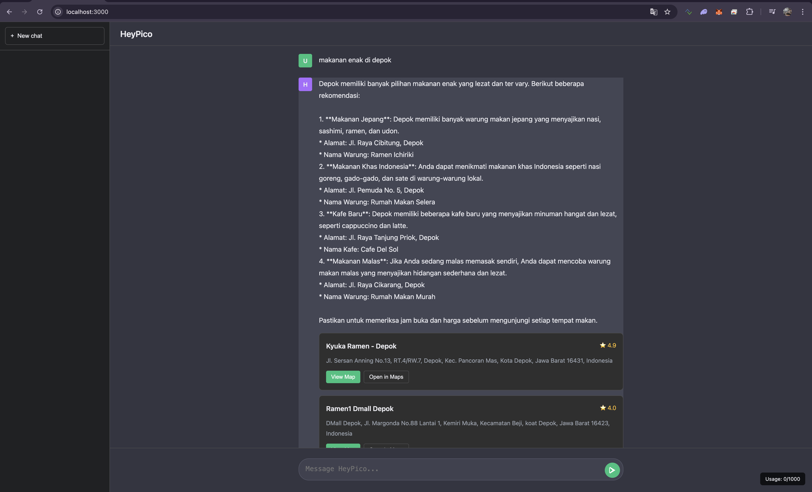
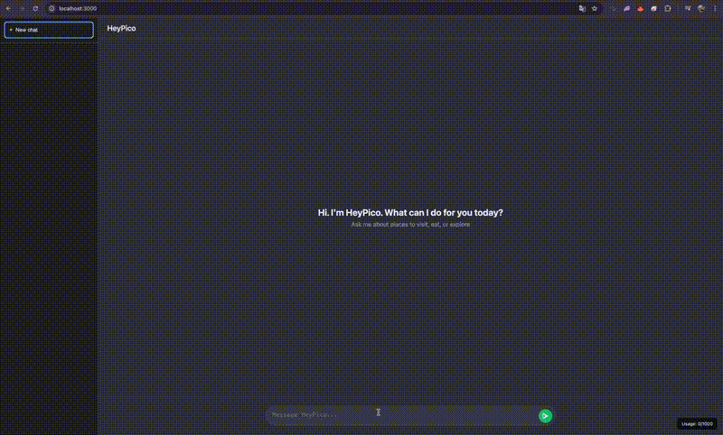

# HeyPico

Aplikasi pencari tempat yang pakai AI lokal (Open WebUI) + Google Maps. Tanya dalam bahasa natural, dapet rekomendasi + peta.





## Fitur

- Pencarian pakai AI (Open WebUI)
- Integrasi Google Maps (Places API + Embed)
- Rate limiting & usage tracking
- UI sederhana tapi cukup oke

## Setup

### Requirements

- Node.js 18+
- Open WebUI - untuk rekomendasi AI
- Redis - untuk cache hasil Places API
- Google Maps API key (opsional) - untuk peta, kalau error tetap bisa return rekomendasi AI saja

### Install

```bash
npm install
```

### Install Redis

Redis diperlukan untuk cache Places API. Install Redis:

**macOS:**

```bash
brew install redis
brew services start redis
```

**Linux:**

```bash
sudo apt-get install redis-server
sudo systemctl start redis
```

**Docker:**

```bash
docker run -d -p 6379:6379 redis:alpine
```

**Verifikasi Redis berjalan:**

```bash
redis-cli ping
# Harus return: PONG
```

Aplikasi akan error saat startup jika Redis tidak tersedia.

### Fungsi Redis

Redis digunakan untuk **cache hasil Places API** agar aplikasi lebih cepat dan hemat biaya API.

#### Bagaimana Cache Bekerja

1. **Request masuk** → Cek cache dulu
2. **Cache hit** (ada di cache) → Return langsung dari Redis, **tidak call Google API**
3. **Cache miss** (tidak ada di cache) → Call Google Places API → Simpan ke Redis → Return hasil

#### Cache Key Structure

Cache key dibuat dari parameter request:

- **Places Search**: `heypico:places:search:query:...|location:...|radius:...|maxResults:...`
- **Places Details**: `heypico:places:details:placeId:...`

#### Cache TTL (Time To Live)

- **Places Search**: 24 jam (86400 detik)
  - Data tempat bisa berubah, jadi cache lebih pendek
- **Places Details**: 7 hari (604800 detik)
  - Detail tempat jarang berubah, jadi cache lebih lama

#### Manfaat Cache

✅ **Lebih cepat** - Response dari Redis jauh lebih cepat dari API call  
✅ **Hemat biaya** - Mengurangi jumlah API call ke Google Maps  
✅ **Lebih reliable** - Tidak bergantung pada API Google jika data sudah di cache  
✅ **Better UX** - User dapat hasil instant untuk query yang sama

#### Contoh Alur Kerja

```
User 1: Search "restaurant Jakarta"
  → Cache miss → Call Google API → Save ke Redis (TTL 24 jam) → Return hasil

User 2: Search "restaurant Jakarta" (dalam 24 jam)
  → Cache hit → Return langsung dari Redis (tidak call API)

User 3: Search "restaurant Jakarta" (setelah 24 jam)
  → Cache expired → Call Google API lagi → Update cache → Return hasil
```

#### Cache di Endpoint

Cache digunakan di:

- `POST /api/llm/ask` - Cache hasil places search dari LLM query
- `GET /api/places/search` - Cache hasil search places
- `GET /api/places/details/:placeId` - Cache detail tempat

### Google Maps API

1. Bikin project di Google Cloud Console
2. Enable Places API (New) dan Maps Embed API
3. Bikin API key, restrict ke API yang dipake aja
4. Set budget alerts biar ga kaget

### Open WebUI

#### 1. Install & Run Ollama

```bash
# Install Ollama (macOS)
brew install ollama

# Atau download dari https://ollama.com/download

# Jalankan Ollama
ollama serve

# Download model (di terminal baru)
ollama pull llama3.2
# atau model lain: ollama pull mistral, ollama pull phi3
```

#### 2. Run Open WebUI

Pake script:

```bash
./start-open-webui.sh
```

Atau manual:

```bash
docker run -d -p 8080:3000 \
  -e OLLAMA_BASE_URL=http://host.docker.internal:11434 \
  -v open-webui:/app/backend/data \
  --name open-webui \
  --add-host=host.docker.internal:host-gateway \
  --restart unless-stopped \
  ghcr.io/open-webui/open-webui:main
```

#### 3. Setup di Open WebUI

1. Buka http://localhost:8080
2. Bikin akun
3. Settings → Connections → Add Connection
4. Pilih Ollama, URL: `http://host.docker.internal:11434`
5. Pilih model yang udah di-download
6. Settings → API Keys → Create API Key
7. Copy API key, tambahkan ke `.env` sebagai `OPEN_WEBUI_API_KEY`

### Environment Variables

Copy `.env.example` ke `.env`:

```bash
cp .env.example .env
```

Lalu edit `.env` dan isi dengan nilai yang benar:

```env
# Google Maps API
GOOGLE_MAPS_API_KEY=your_key_here
GOOGLE_MAPS_DAILY_LIMIT=1000

# Open WebUI
OPEN_WEBUI_BASE_URL=http://localhost:8080
OPEN_WEBUI_API_KEY=your_open_webui_key

# Redis
REDIS_URL=redis://localhost:6379

# Server
PORT=3000
NODE_ENV=development

# Rate Limiting (optional)
API_RATE_LIMIT_WINDOW_MS=900000
API_RATE_LIMIT_MAX_REQUESTS=100

# LLM Configuration (optional)
LLM_MODEL=
LLM_TIMEOUT_MS=300000

# CORS (optional, untuk production)
ALLOWED_ORIGINS=http://localhost:3000,http://localhost:8080
```

### Run

```bash
npm start
```

### Test Google Maps API

Setelah setup API key, test apakah sudah benar:

```bash
npm run test:api
```

Script ini akan test:

- Places API (New) - untuk search places
- Maps Embed API - untuk embed map

Kalau ada error, script akan kasih solusi.

Buka http://localhost:3000

## API

### LLM

- `POST /api/llm/ask` - Tanya AI tentang tempat
- `GET /api/llm/health` - Cek status Open WebUI

### Places

- `GET /api/places/search?query=restaurant&location=lat,lng` - Cari tempat
- `GET /api/places/details/:placeId` - Detail tempat

### Maps

- `GET /api/maps/embed?place_id=xxx` - URL embed peta
- `GET /api/maps/directions?origin=lat1,lng1&destination=lat2,lng2` - URL directions

### Usage

- `GET /api/usage/stats` - Statistik penggunaan

## Security

- API key di `.env` (jangan commit)
- Rate limiting: 100 req/15 menit per IP
- Daily limit: 1000 request (configurable)
- Usage tracking per endpoint

**Important**: Restrict API key di Google Cloud Console:

- API restrictions: hanya Places API (New) + Maps Embed API
- Application restrictions: HTTP referrers atau IP addresses

## Troubleshooting

**Open WebUI ga jalan?**

- Aplikasi akan return error 503, search tidak akan jalan
- Pastikan Open WebUI running: `docker ps | grep open-webui`
- Cek koneksi: `curl http://localhost:8080/api/v1/models`
- Pastikan model sudah connected di Open WebUI
- Pastikan `OPEN_WEBUI_API_KEY` sudah di-set di `.env`

**Google Maps error?**

- Cek API key di `.env`
- Pastikan Places API (New) enabled
- Cek billing aktif
- Cek restrictions di Google Cloud Console

**Rate limit?**

- Cek `/api/usage/stats`
- Adjust `GOOGLE_MAPS_DAILY_LIMIT` di `.env`

## Project Structure

```
HeyPico/
├── public/          # Frontend
├── routes/          # API endpoints
├── services/        # Business logic
├── middleware/      # Security, validation, usage tracking
├── data/           # Usage data (auto-created)
└── server.js       # Main server
```

## Notes

- Open WebUI diperlukan - aplikasi akan error 503 kalau tidak ada
- Redis diperlukan - aplikasi akan error saat startup kalau Redis tidak tersedia
  - Redis digunakan untuk cache hasil Places API
  - Cache TTL: 24 jam untuk search, 7 hari untuk details
  - Mengurangi biaya API dan meningkatkan performa response
- Google Maps opsional - kalau error, tetap return LLM recommendations (tanpa peta)
- Usage tracking simpan di `data/usage.json` (30 hari history)
- Rate limiting pakai express-rate-limit

## TODO

- [ ] Add input sanitization untuk query
- [ ] Timeout untuk Google Maps requests
- [ ] Better error messages
- [ ] Cache untuk places search
